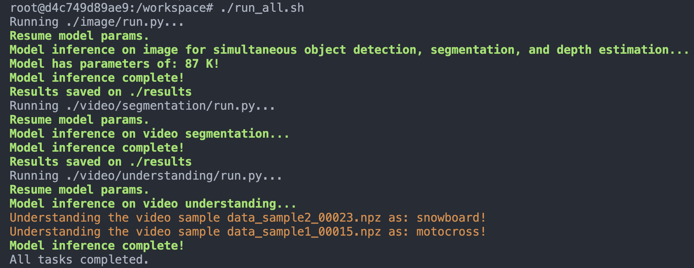

# Photonic-Electronic-Accelerator

This repository provides a unified pipeline for running image and video inference in the submitted manuscript titled `Photonic-Electronic Accelerator Enabling Vision Foundation Model at the Edge`. The project supports multimodal and multitask computer vision, including object detection, segmentation, depth estimation, video segmentation, and video scene understanding.

---

## 🖥️ System Requirements

To run this project smoothly, your system should meet the following requirements:

- **Operating System**: Ubuntu 22.04
- **Python**: 3.10.12
- **PyTorch**: 2.3.1 (with CUDA support)
- **GPU**: NVIDIA RTX 4090 or higher
- **CUDA**: 12.1.1 or higher

See all detailed software dependencies in `./docker/requirements.txt`.
> Make sure the appropriate NVIDIA driver and CUDA toolkit are installed for full GPU acceleration.

---

## 🛠️ Installation & Usage Guide
### ⬇️ Step 1: Clone the Repository

Clone this repository and ensure the code, pre-trained models, and the provided data are placed in the correct subdirectories:

```bash
git clone https://github.com/jiayong012/Photonic-Electronic-Accelerator
cd Photonic-Electronic-Accelerator
```

### Project Structure

```
./
├── demo/
├── docker/ # environment and software dependencies setup
│   ├── Dockerfile
│   └── requirements.txt
├── image/  # simultaneously object detection, segmentation, and depth estimation on image domain
│   ├── ckpt/
│   │   └── model.pth
│   ├── data/
│   │   ├── xxx*.npz
│   ├── xxx.so
│   ├── run.py
│   └── util/
├── video/  # video segmentation and understanding
│   ├── data/
│   │   ├── xxx.npz
│   ├── segmentation/
│   │   ├── ckpt/
│   │   │   └── model.pth
│   │   ├── xxx.so
│   │   └── run.py
│   └── understanding/
│       ├── ckpt/
│       │   └── model.pth
│       ├── xxx.so
│       └── run.py
├── run_all.sh  # script to run all modules sequentially
└── README.md
```

---


### 📦 Step 2: Build the Runtime Environment

Use the provided `./docker/Dockerfile` and `./docker/requirements.txt` to build a Docker image that contains all required software dependencies (e.g., PyTorch, Python, OpenCV, etc.).

```bash
# Navigate to the project root
cd Photonic-Electronic-Accelerator/docker

# Build the Docker image
docker build -t photonic-electronic-env .
```

> This image includes Python, Pytorch, CUDA, and all Python packages specified in `requirements.txt`.

---

### 🚀 Step 3: Launch a Docker Container

Use the built Docker image to start a container and mount the current project directory:

```bash
docker run -it --gpus all -v $(pwd):/workspace --name inference photonic-electronic-env
```

This command:
- Launches an interactive shell (`bash`) inside the container
- Mounts the current directory as `/workspace`
- Sets `/workspace` as the working directory

---


### 🧪 Step 4: Execute All Inference Modules

Run the full pipeline using the provided script under `/workspace` in the container:

```bash
cd /workspace
chmod +x run_all.sh
./run_all.sh
```

The script will generate results for image and video in sequence and store the results in the corresponding folders.

---

### ✅ Expected Output

Each module will output its results in the terminal or store results in the corresponding folders. An example terminal output is shown below:



> Note that all `run.py` scripts are properly executed in relative paths and generate results in their own subfolders.

---

## 📄 License

This project is open source and released under the **MIT License**.
